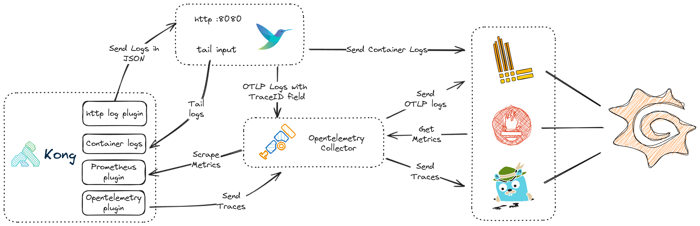
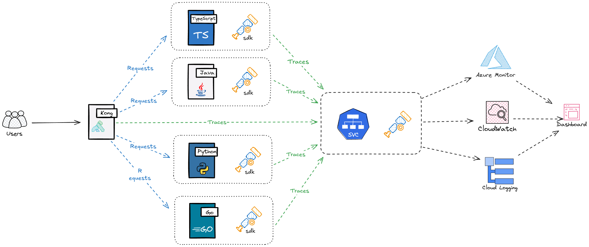

# Kong observability with Grafana

This repo demonstrate how to config [Kong](https://github.com/Kong/kong) to ship logs, metrics and traces to different backend and use grafana as the dashboard to visulise the data.

The solution 

**Backend**
- Logs -> Loki
- Metrics -> Prometheus
- Traces -> Tempo

**App**
- [fluentbit](https://www.fluentbit.io/)
- Httpbin
- [Hotrod](https://github.com/jaegertracing/jaeger/tree/main/examples/hotrod)

### Kubernetes

Inside the `kubernetes/` folder, run `./install.sh` to deploy everything for you.

- Kong is also running in dbless mode with Kong ingress controller with Gateway API enabled.
- The script detects environment variable `KONG_LICENSE_DATA` and reates a `KongLicence` object accordingly.
- I have to create `clusterrole` and `clusterrolebinding` for opentelemetry collector to scrape the Kong pod. If you have a better solution, please submit your PR.
- Grafana dashboard password is also disabled. Please remove the `env` section of [values.yaml](https://github.com/liyangau/kong-observability-grafana/blob/main/kubernetes/grafana/values.yaml) if you need the log in page.

Detail explaination of the solution can be found on this [blog post](https://tech.aufomm.com/kong-observability-with-grafana-a-unified-view-for-logs-metrics-and-traces).

### Auto Instrumentation

OpenTelemetry Collector Operator supports [Zero-code Instrumentation](https://opentelemetry.io/docs/zero-code/). From high level, it works as below.

I have added my `order tracking` app as a demo. With no manual instrumentation, the otel operator injects python agent packages to my code.  Based on the libraries that I use, this agent primarily uses monkey patching to modify library functions at runtime. For more information, please refer to [official doc](https://opentelemetry.io/docs/zero-code/python/).

Please note I also enable otel logging by setting `OTEL_PYTHON_LOGGING_AUTO_INSTRUMENTATION_ENABLED=true` environment variable on [auto-instrumentation.yaml](kubernetes/orders/auto-instrumentation.yaml).